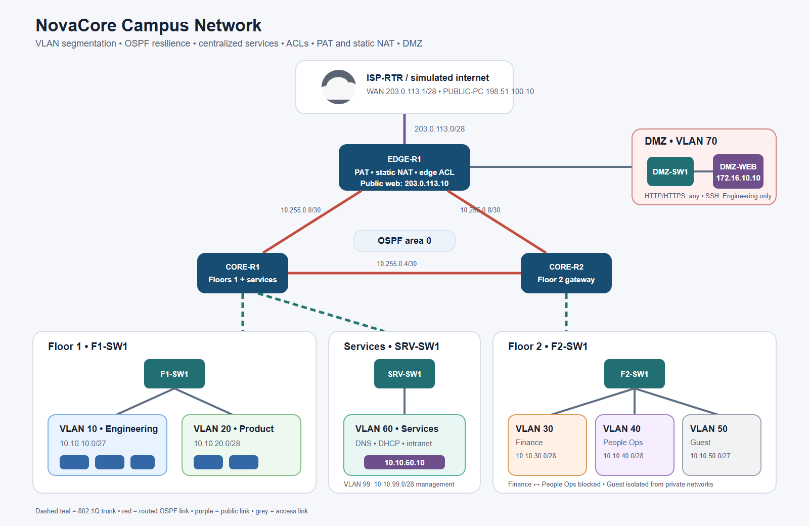

# NovaCore Campus Network

NovaCore is a Cisco Packet Tracer-ready campus network design for a three-zone office: Floor 1, Floor 2, and a protected services/DMZ zone. It is an original project with a similar learning scope to the supplied Bugs Network reference.

## What the project demonstrates

- VLAN segmentation and router-on-a-stick
- VLSM subnetting
- Central DHCP with DHCP relay
- Internal DNS and HTTP services
- Multi-router OSPF with a redundant triangle
- Department-to-department ACLs
- Guest isolation
- PAT/NAT overload for internet access
- Static NAT for a public-facing DMZ web server
- SSH-only device management
- A structured verification and fault-finding plan

## Project topology

## Files

- `BUILD_GUIDE.md` — exact Packet Tracer construction sequence
- `IP_ADDRESSING.md` — VLAN, WAN, server, and DHCP plan
- `TEST_PLAN.md` — expected pass/fail tests and verification commands
- `configs/` — ready-to-paste IOS configurations and server GUI setup
- `diagrams/topology.svg` and `diagrams/topology.png` — clean logical topology diagram

## Suggested Packet Tracer devices

- 4 × Cisco 2911 routers: `ISP-RTR`, `EDGE-R1`, `CORE-R1`, `CORE-R2`
- 4 × Cisco 2960 switches: `F1-SW1`, `F2-SW1`, `SRV-SW1`, `DMZ-SW1`
- 2 × Server-PT: `SERVICES-SRV`, `DMZ-WEB`
- At least 9 × PC-PT clients, with one or two clients per department plus `PUBLIC-PC`
- HWIC-2T serial modules for `EDGE-R1`, `CORE-R1`, and `CORE-R2`

## Logical zones

- Floor 1: Engineering (VLAN 10) and Product (VLAN 20)
- Floor 2: Finance (VLAN 30), People Operations (VLAN 40), and Guest (VLAN 50)
- Services: DNS/DHCP/intranet (VLAN 60) and management (VLAN 99)
- DMZ: public web server on `172.16.10.0/28`
- WAN: three routed `/30` links running OSPF area 0

## Security policy

- Finance and People Operations cannot initiate traffic to one another.
- Guest clients can use internal DNS and reach the simulated internet, but cannot reach RFC 1918 internal networks or the DMZ.
- The DMZ web server accepts HTTP/HTTPS from any source and SSH only from Engineering.
- Incoming internet traffic is denied to private address space; only HTTP/HTTPS to the public web address is permitted.
- VTY access uses SSH with a local administrative account and accepts connections only from Engineering or the management VLAN.

## Important note

The included files are a complete build pack, but the `.pkt` binary itself must be created and saved in Cisco Packet Tracer. Packet Tracer was not installed in the build environment, so the topology could not be opened and simulated here. Follow `BUILD_GUIDE.md`, paste the supplied configurations, complete the server GUI settings, then run `TEST_PLAN.md` before saving as `NovaCore-Campus-Network.pkt`.

The credentials in the configuration files are classroom-only placeholders. Change them before using any part of this design outside a lab.
